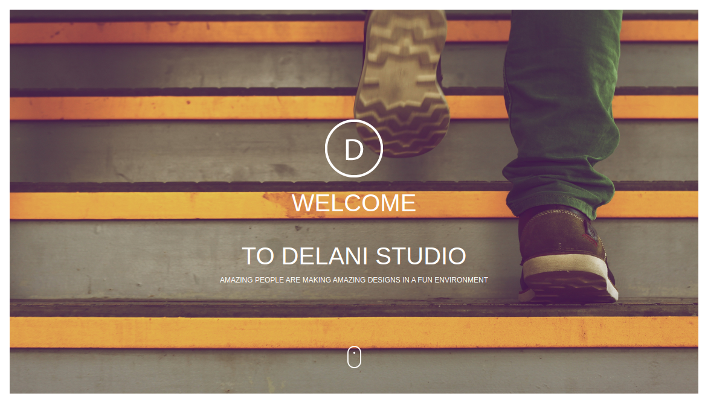

# DELANI STUDIO
https://eve320.github.io/Delani-studio/

## Description
This project is a landing page for delani studios showing their services, portfolio and includes a form that allows users to give feedback to delani studios and also subscribe to their mailing list.
## Authors
Evelyne

## Project setup instructions
* In the terminal navigate to the directory you want to save the project
* Clone the project (https://github.com/Eve320/Delani-studio.git)
* Navigate into the created folder
* Open the project with a text editor eg atom (atom .)

## Technologies used
* HTML
* Javascript
* CSS
* Jquery

## Contact
You can get intouch for any assistance.
enduku98@gmail.com

## license infor
MIT license

Copyright (c) 2020 **Evelyne**
